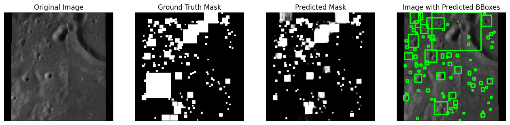

# Lunar Crater Detection using CNN

## Overview

This project implements a **deep ResNet-UNet model** for crater detection using TensorFlow/Keras. The CNN model is designed to segment craters in images, leveraging the **ResNet blocks** for feature extraction and **UNet architecture** for upsampling and segmentation.

## Model Architecture

The model consists of:

- **ResNet Blocks**: Residual learning helps in deep feature extraction while preventing vanishing gradients.
- **Downsampling Path (Encoder)**: Uses max-pooling and ResNet blocks to extract deep spatial features.
- **Bottleneck Layer**: Captures the most abstracted features with high receptive fields.
- **Upsampling Path (Decoder)**: Uses transposed convolutions and skip connections to recover spatial information and generate segmentation masks.

### ResNet Block

Each **ResNet block** contains:

- Two convolutional layers (3x3 kernel)
- Batch normalization for stability
- ReLU activation
- Residual connection to allow gradient flow

## Usage

 - Clone the repo
   ```sh
   git clone https://github.com/scifre/crater-detection.git
   cd crater-detection
    ```
 - Install dependencies
   ```sh
   pip install -r requirements.txt
   ```
 - Dataset- [Impact Moon Craters (LU3M6TGT)](https://www.kaggle.com/datasets/riccardolagrassa/lu3m6tgt?resource=download-directory) dataset from Kaggle

 - After downloading the dataset, run ```move_empty.py```, to clean the dataset of empty image and labels, these are the images donot contain any craters, so we move them to separate directory


## Results

During several training runs, the model yeilds an averange validation accuracy of about 0.95 and a validation loss of about 0.18

Details of the most recent run:

 - Training merics: 
  ```
  - accuracy: 0.9749
  - dice_coefficient: 0.9062
  - f1_score: 0.9062
  - loss: 0.0828
  - precision: 0.9092
  - recall: 0.9037 
  - learning_rate: 1.2500e-04
  ``` 
 - Validation metrics:
  ```
  - val_accuracy: 0.9474
  - val_dice_coefficient: 0.8173
  - val_f1_score: 0.8173
  - val_loss: 0.1885
  - val_precision: 0.8392
  - val_recall: 0.7972
  ```

- Training and Validation accuracy over epochs:
  

- Test results over random examples, below examples compare:
  - Original image
  - Ground truth mask(created using the labels from the dataset)
  - Predicted mask(output mask- generated by the model)
  - Mask with bounding boxes(Bounding boxes created using the predicted mask, layered over the original image)

  - 
    
    
    
    


## Conclusion

This **ResNet-UNet model** effectively detects craters by combining deep residual learning with UNet-style segmentation. The use of **skip connections and residual blocks** improves performance, making it robust for complex image segmentation tasks.


